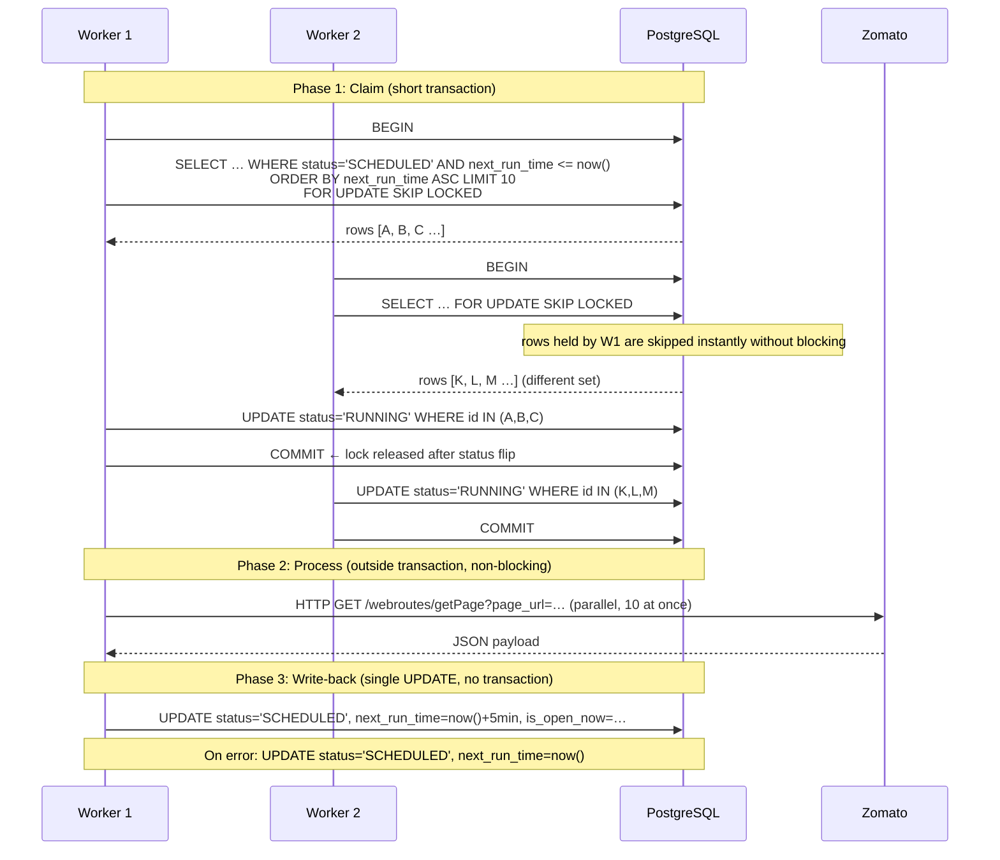
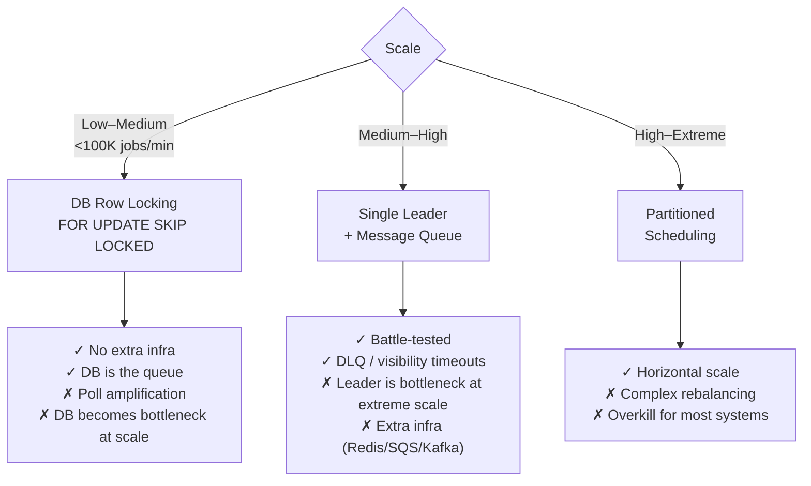
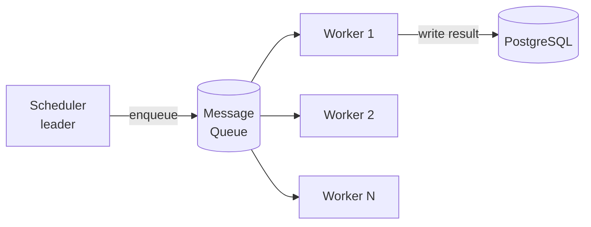

# Resto Monitor Design Document

## Overview
 
**Resto** is a restaurant availability monitoring service POC. It periodically scrapes Zomato's internal page API to detect when a set of restaurant's actual open/closed state diverges from its expected hours. 

The system is a TypeScript monorepo with three top-level packages:

| Package | Role |
|---|---|
| `packages/resto-db` | Drizzle ORM schema, migrations, DB factory |
| `apps/resto-api` | oRPC HTTP API consumed by the frontend |
| `apps/resto-scrape-worker` | Background polling worker (the focus of this document) |
| `apps/resto-front` | React/Vite dashboard |

---

## Data Model

```
app.restaurant_availabilities
┌─────────────────┬──────────────────────────────────────┐
│ id              │ uuid PK                               │
│ res_id          │ text UNIQUE NOT NULL  (Zomato ID)     │
│ res_url         │ text UNIQUE NOT NULL                  │
│ name            │ text NOT NULL                         │
│ is_open_now     │ boolean NOT NULL                      │
│ is_perm_closed  │ boolean NOT NULL                      │
│ is_temp_closed  │ boolean NOT NULL                      │
│ expected_open   │ boolean NOT NULL DEFAULT false        │
│ res_status_text │ text                                  │
│ scrape_status   │ text NOT NULL DEFAULT 'SCHEDULED'     │  ← state machine
│ next_run_time   │ timestamp NOT NULL DEFAULT now()      │  ← pre-computed scheduler clock
│ created_at      │ timestamp                             │
│ updated_at      │ timestamp (auto-updated)              │
└─────────────────┴──────────────────────────────────────┘

app.restaurant_timings
┌─────────────────┬──────────────────────────────────────┐
│ id              │ uuid PK                               │
│ res_id          │ text FK → restaurant_availabilities   │
│ day_of_week     │ integer  (0=Sun … 6=Sat, Postgres DOW)│
│ opens_at        │ time NOT NULL                         │
│ closes_at       │ time NOT NULL                         │
│ created_at / updated_at                                 │
└─────────────────┴──────────────────────────────────────┘
```

`scrape_status` drives a simple two-state machine:

```
SCHEDULED ──(claim)──► RUNNING ──(success | error)──► SCHEDULED
```

### Pre-computed `next_run_time`

A key scheduling decision is storing a **pre-computed next execution timestamp** on the row rather than storing a cron expression and evaluating it on every poll. This means the claim query is a simple indexed range scan:

```sql
WHERE scrape_status = 'SCHEDULED' AND next_run_time <= NOW()
```

The alternative, evaluating cron schedule expressions against every row on every poll cycle, does not scale: with millions of rows it becomes a full table scan on CPU-bound expression evaluation per row. The pre-computation pattern is used for exactly this reason.

---

## Distributed Exactly-Once Scraping (Utmost-Once with Idempotent Workers)

### The Problem

The fundamental challenge of distributed scheduling is not the scheduling logic itself but in achieving **exactly-once execution** when multiple workers independently detect the same due jobs. Without coordination, all workers simultaneously claim the same row, scraping the same restaurant multiple times. We need mutual exclusion without a centralised lock manager.
 
### Solution: Optimistic DB-Backed Claim with `FOR UPDATE SKIP LOCKED`

Work is divided into **three clearly separated phases**, each with different transactional scope. Critically, **job execution (Phase 2) is fully decoupled from the claim transaction (Phase 1)** a blocking scrape cannot block other workers from claiming their batches.



### Why `FOR UPDATE SKIP LOCKED` is the Right Primitive

`SELECT … FOR UPDATE` acquires a row-level exclusive lock. The critical addition is `SKIP LOCKED`: instead of blocking or throwing a serialisation error, competing workers **silently skip any row already locked by another session**. This gives us:

1. **No external coordinator**: PostgreSQL's lock table is the only source of truth during the claim window.
2. **Short critical section**: the transaction commits after the `UPDATE status='RUNNING'`, so the exclusive lock is held for only two SQL statements.

After the claim transaction commits, `status = 'RUNNING'` acts as a persistent guard: even if a new worker polls immediately, it filters on `status = 'SCHEDULED'`, so the in-flight row is invisible to all future claim attempts.

### Idempotency and Retry Semantics

The guarantee is **utmost-once** (not exactly-once in the strict sense), with best-effort retry on failure:

- **Happy path**: on successful scrape the row is reset to `SCHEDULED` with `next_run_time = now() + 5 min`.
- **Error path**: the row is reset to `SCHEDULED` with `next_run_time = now()`, making it immediately eligible for re-claim. There is no exponential back-off (see Gaps).
- **Worker crash**: if the process dies between claim and write-back the row is **stuck in `RUNNING` forever**. This is a gap in the POC.

Because the write-back is an idempotent `UPDATE` keyed on `res_id`, replaying it is safe.

### Missed Job Policy

The current error path sets `next_run_time = now()` equivalent to the "fire immediately on recovery".

---

## Scheduler Architecture Patterns

Three patterns exist for distributed job scheduling, with clear applicability criteria:



Resto currently uses **Pattern 1 (DB Row Locking)**. The restaurant count (tens to low hundreds) sits comfortably within its limits.

## Alternative Considered: Single-Leader Scheduler + Message Queue

A common alternative is a dedicated scheduler process that owns all timing state and pushes jobs into a message queue (e.g., BullMQ on Redis, SQS, or RabbitMQ). Workers consume jobs and ack on completion.



**Advantages of the queue approach:**
- Native dead-letter queues, visibility timeouts, and retry policies without custom code.
- Backpressure and rate-limiting are first-class features.
- The scheduler and workers are independently scalable.
- Observability tooling (queue depth, consumer lag) is mature.
- Missed-job policies (fire-once, skip, age-limit) are configurable per job type.

**Why we chose the DB-backed approach instead:**
- Zero additional infrastructure; no Redis or message broker to provision.
- The restaurant table *is* the job queue; no sync between two stores.
- For the current scale (tens to low hundreds of restaurants) the polling overhead is negligible.
- Simpler operational model for a small monorepo.

The DB-backed approach becomes increasingly painful as volume grows, primarily due to polling amplification and lack of push semantics.

---
 
## Known Gaps

- Worker crash leaves rows stuck forever
- No `SIGTERM` handler; mid-batch kill leaves rows in `RUNNING`.
- Error path sets `next_run_time = now()`, flooding the DB during a Zomato outage.
- 10 concurrent fetches per worker; multiple replicas risk IP blocks via unknown rate limiting.
- DB indexing not evaluated
- Observability and alerting not implemented
